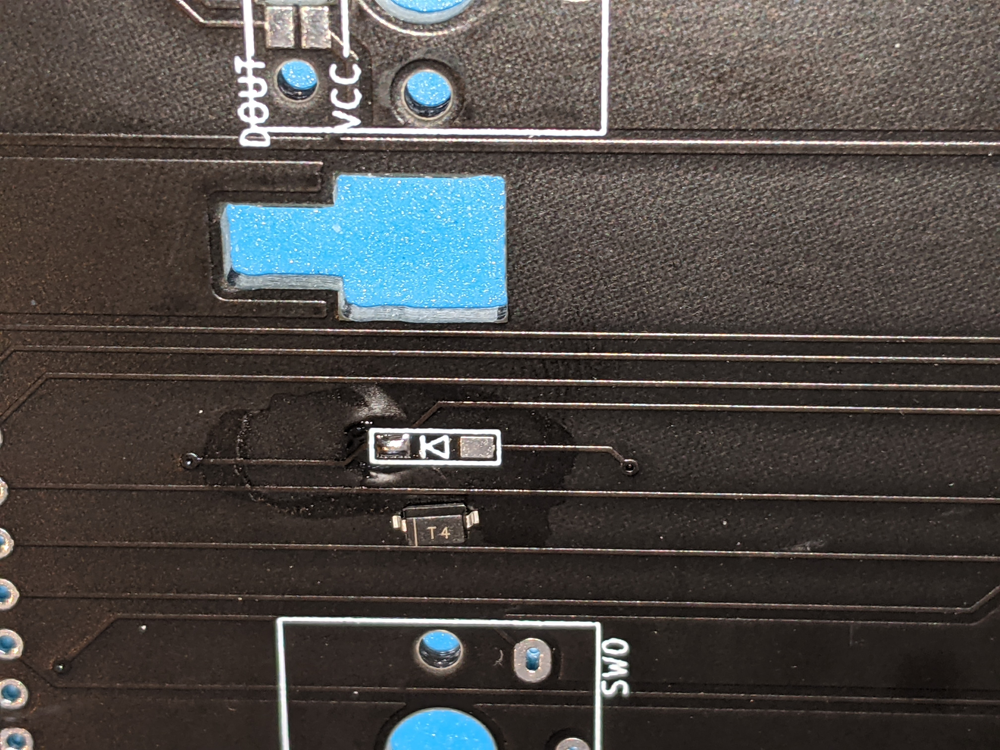
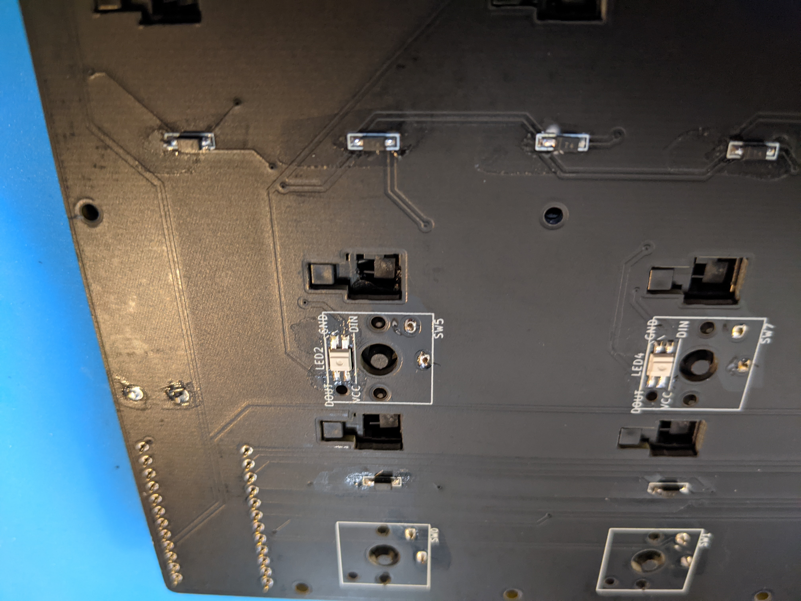

# 音楽ゲームコントローラ Dive 9 ビルドガイド

**注意 この商品は、個人が作成する同人キットです。ゲームの公式グッズではありません。ゲームでの動作保証や、公式と同様の操作感を保証しているものではありません。また、使用にははんだ付け等の制作が必要になります。本商品は完成を保証するものではありません。**

## 特徴

- ゲームパッドとして認識し、 9 キー の同時押しに対応
- 薄型キースイッチ Kailh Choc v1 を使用
- 某ゲームのキースイッチと同じサイズのキーキャップ（キーキャップは別途用意する必要があります。後述）

## 動作確認ゲーム

**注意 個人が動作確認したゲームであり、公式がサポートするものではありません。また、現在も動作可能であることを保証するものではありません。**

- Windows ポップンミュージック Lively

## キットの内容物

- トッププレート
- PCB
- Kailh Choc スタビライザー x9
- 2 足タクトスイッチ
- 4 足タクトスイッチ
- ダイオード x14
- RGB LED SK1812 MINI-E x9
- ゴム足 x6

## キットの他に必要なもの

- Kailh Choc v1 スイッチ x13
- ゲームキー用キーキャップ x9
- Kailh Choc v1 キーキャップ x4
- Pro Micro（ATmega32U4）
- Pro Micro 用コンスルー x2
- マイクロ USB ケーブル（Pro Micro と PC の接続用）

## 組み立てに必要なもの

- はんだこて
- はんだ
- ピンセット（細かいパーツをつまめます）
- ニッパ（タクトスイッチの足を切断します）
- マスキングテープ（はんだ付けの時のパーツの固定に使います）

### あると良いもの

- 3D プリンター（キーキャップ製造）
- フラックス（はんだの乗りが良くなります）
- フラックス除去剤
- ハンダ吸い取り器、ハンダ吸い取り線（ミスした時用）
- エボキシ系接着剤（Pro Micro の USB 端子のもげ防止加工）

## ゲームキー用キーキャップ

ゲームキー用キーキャップは付属しておりません。別途、用意する必要があります。

既成品では、以下のものを使うことができます。

- Kailh Choc v1 2U キーキャップ

キーキャップ用のデータは公開しています。3D プリンターを使って、キーキャップを製造することができます。


- [STL ファイル ./keycap/2dx_keycap_v1.0.3.stl](./keycap/2dx_keycap_v1.0.3.stl)
- [FreeCAD ファイル ./keycap/keycap.FCStd1](./keycap/keycap.FCStd1)

3D プリントサービス DMM Make で、キーキャップセットを公開しています（v.1.0.1 と書かれていますが、DMM Make MJF に対応したサイズになっています。こちらから、MJF 素材のキーキャップを注文可能です。MJF 素材の場合、ゲームにも耐えうる強度を持ちますが、LED の光は通しません。


[注文ページ https://make.dmm.com/item/1311243/（準備中）](https://make.dmm.com/item/1311243/)

少数ですが、自宅の 3D プリンター ELEGOO MARS PRO で製造したキーキャップも販売しています。


## ビルド手順

**注意 スタビライザーはキースイッチのはんだ付けより先に取り付ける必要があります。キースイッチのはんだ付けは手順の最後になります。**

### ダイオードの実装

向きに気をつけてダイオードを実装します。

まず、片側に予備ハンダとして、片側にハンダを載せます。


ダイオードの向きを写真のようにします。



予備ハンダを溶かしつつ、反対側からピンセットでダイオードを実装します。
**この時、ダイオードがピッタリと基盤に密着していることを確認してください。**
密着していない場合には、ピンセットで上から押しつつ、ふたたびはんだを溶かして密着させます。


もう片方の足をはんだ付けします。


### LED の実装

LED の向きを写真のようにします。GND が、LED の足のうち斜めになっている足の場所になります。


LED をまず穴に入れ、位置決めをします。


マスキングテープで、LED を固定します。この時、片方の足を出した状態にします。


片側をはんだ付けします。


マスキングテープを外して、もう片側もはんだ付けをします。


### 4 足タクトスイッチの実装

ここに 4 足のタクトスイッチを実装します。


マスキングテープで固定します。


片側をはんだ付けし、マスキングテープを外して、もう片方もはんだ付けします。


### 2 足タクトスイッチの実装

2 足のタクトスイッチを、4 足のタクトスイッチと同じ面をボタン側にして、差し込みます。
RESET の文字がある方が、ボタン側です。


足の出ている反対側から、はんだ付けをします。


はんだ付けの後、あまりの足をニッパで切断します。


### Pro Micro のもげ防止

Pro Micro の Micro USB 端子は非常にもげやすいものになっています。 これを防止するため、端子に エボキシ系接着剤を塗布します。 誤って端子の中に接着剤が入り込まないように気をつけてください。


### Pro Micro のはんだ付け

ピンヘッダには向きがあります。詳しくは、遊舎工房の解説を確認ださい。

https://yushakobo.zendesk.com/hc/ja/articles/360044233974-%E3%82%B3%E3%83%B3%E3%82%B9%E3%83%AB%E3%83%BC-%E3%82%B9%E3%83%97%E3%83%AA%E3%83%B3%E3%82%B0%E3%83%94%E3%83%B3%E3%83%98%E3%83%83%E3%83%80-%E3%81%AE%E5%8F%96%E3%82%8A%E4%BB%98%E3%81%91%E6%96%B9%E3%82%92%E6%95%99%E3%81%88%E3%81%A6%E4%B8%8B%E3%81%95%E3%81%84


Dive 9 では Pro Micro を写真の向きで使います。

先に、Pro Micro とピンヘッダを PCB に差し込みます。 その上から、 Pro Micro とピンヘッダのみをはんだづけします。 ピンヘッダと PCB ははんだ付けしないようにします。

Pro Micro は脆弱な部品ため、破損した場合交換が可能となります。

### Pro Micro にファームウェアを書き込む

以下のファームウェアを、[QMK Toolbox](https://github.com/qmk/qmk_toolbox/releases)を使って書き込みます。


QMK Toolbox の使い方は[サリチル酸さんの記事](https://salicylic-acid3.hatenablog.com/entry/qmk-toolbox)が詳しいため、そちらを確認ください。

### Pro Micro に USB を差し込み、PC と接続し、LED が正しく点灯することを確認する

LED ははんだ付けをミスしやすいパーツです。
スイッチのはんだ付けの前に、全てのキーが光ることを確認します。


全てのキーが光らない場合、はんだ付けが正しくされているか確認します。

また、LED は非常に損傷しやすい部品です。 接続を誤った場合、LED が萌えてしまい、使えない状態になってしまいます。
そうなってしまった場合には、SK6812MINI-E を別途ご購入ください。

### スタビライザーをつける

スタビライザーの向きに気をつけます。この向きで上から差し込みます。


1 つのキーにつき、2 つ用意します。


ワイヤーを差し込みます。


トッププレートを裏返しにします。白い枠のない方を上にします。


トッププレートにスタビライザーを差し込みます。


トッププレートの表からはこのように見えます


全てのキーにスタビライザーを設置します。


トッププレートを、PCB に重ねて、スタビライザーを挟むようにしてください。


### スイッチのはんだ付け

キースイッチをトッププレートから差し込みます。
**このとき、バチンとはまるまで差し込んでください。**
**はんだづけする前に全てのキーを差し込みます。**


裏返して、全てのスイッチから 2 つの足が出ていることを確認します。


以下のように足が出ていない場合、そのスイッチを指し直します。


**1 つ目のはんだづけする前に全てのキーで足が出ていることを確認してください。**

キースイッチを裏からはんだ付けします。



### キーキャップ、ゴム足の取り付け

キーキャップとゴム足を取り付けて完成です。


## キー配置

初期ファームウェアのキー配置は以下のようになっています。

標準設定（ジョイパッドのキー）

```
    [10]    [11]    [12]    [13]
    [ 2]    [ 4]    [ 6]    [ 8]    [FN]
[ 1]    [ 3]    [ 5]    [ 7]    [ 9]
```

FN キーと一緒に押すことで、以下のように機能します。

- FN+1 : 標準設定（IIDX 1P 配色）
- FN+3 : ポップンミュージック Lively 設定
- FN+5 : 標準設定（IIDX 2P 配色）
- FN+10 : 音量アップ
- FN+11 : 音量ダウン
- FN+12 : ミュート
- FN+13 : ESC

ポップンミュージック Lively 設定の場合、以下のキーに変わります。

- 10 : キーボード 5 キー
- 11 : キーボード 1 キー
- 12 : キーボード 2 キー
- 13 : キーボード バックスペースキー
